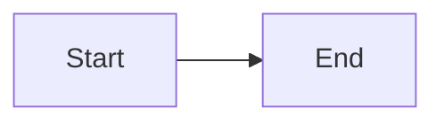

# MD Preview PWA — Features & Options

**Version:** 1.1.0 | **Repo:** [Marketing-Bull/md-preview-pwa](https://github.com/Marketing-Bull/md-preview-pwa)
**URL:** `http://100.66.112.29:8090` | **PM2:** `md-preview` (port 8090)

---

## ✍️ Editor

| Feature | Detail |
|---------|--------|
| **Live Markdown Editor** | Full textarea with monospace font, tab support, line wrapping |
| **Live Preview** | Renders as you type with 150ms debounce |
| **Split View** | Editor (left) + Preview (right), resizable divider |
| **View Modes** | Split · Editor Only · Preview Only (cycle with `Cmd+E`) |
| **Column Resizer** | Drag the divider to adjust editor/preview ratio |
| **Tab Support** | Tab key inserts 2 spaces instead of changing focus |
| **Bold/Italic Shortcuts** | `Cmd+B` wraps selection in `**bold**`, `Cmd+I` in `*italic*` |
| **Editable File Name** | Click the filename in toolbar to rename (auto-appends `.md`) |

---

## 📄 Markdown Rendering

| Feature | Detail |
|---------|--------|
| **GitHub Flavored Markdown** | Full GFM support via `marked` v11 |
| **Tables** | Pipe tables with header styling |
| **Task Lists** | `- [x]` renders as checkboxes |
| **Blockquotes** | Styled with accent border |
| **Inline Code** | Backtick code with background highlight |
| **Line Breaks** | `breaks: true` — single newlines create `<br>` |
| **Auto-linking** | URLs automatically converted to links |

---

## 🧜 Mermaid Diagrams

| Feature | Detail |
|---------|--------|
| **Full Mermaid v10** | Flowcharts, sequence, class, state, ER, gantt, pie, mindmap, timeline, etc. |
| **Dark/Light Aware** | Mermaid theme switches with app theme |
| **Error Display** | Invalid diagrams show red error message instead of breaking |
| **Render on Parse** | Diagrams render inline after markdown parsing |

**Usage:**
````

````

---

## 🎨 Syntax Highlighting

| Feature | Detail |
|---------|--------|
| **highlight.js** | Auto-detection + language-specific highlighting |
| **Copy Button** | Every code block has a "Copy" button (top-right) |
| **Supported Languages** | 180+ (JS, TS, Python, Bash, SQL, YAML, JSON, HTML, CSS, etc.) |
| **Theme** | Follows dark/light mode (Atom One Dark / default) |

**Stored Highlight Themes (in Zustand, not yet exposed in UI):**
- GitHub · GitHub Dark · Monokai · Dracula
- Solarized Dark · Atom One Dark · VS Light

---

## 🌙 Theming

| Feature | Detail |
|---------|--------|
| **Dark Mode** (default) | Navy background (`#001a33`), blue accent (`#4da6ff`) |
| **Light Mode** | White background, dark text |
| **Toggle** | Moon/sun button in toolbar or `Cmd+D` |
| **Persisted** | Theme choice saved to `localStorage` |
| **CSS Variables** | `--bg`, `--bg-secondary`, `--text`, `--accent`, `--border` |

---

## 🔍 Find & Replace

| Feature | Detail |
|---------|--------|
| **Find Bar** | `Cmd+F` opens find bar above editor |
| **Match Count** | Shows "X of Y" matches |
| **Navigate** | Next (`Enter`) / Previous (`Shift+Enter`) match |
| **Replace** | Single replace or Replace All |
| **Case Sensitive** | Toggle option |
| **Regex** | Toggle option for regex search |
| **Close** | `Escape` closes find bar |

---

## 📋 Table of Contents (Sidebar)

| Feature | Detail |
|---------|--------|
| **Auto-Generated** | Built from all `h1`–`h6` headings |
| **Active Tracking** | Current heading highlighted as you scroll |
| **Click to Navigate** | Click any heading to scroll to it |
| **Indented Levels** | Visual hierarchy matching heading levels |
| **Position** | Bottom-left sidebar in preview pane |

---

## 📊 Status Bar

| Feature | Detail |
|---------|--------|
| **Word Count** | Real-time word count |
| **Character Count** | Total characters |
| **Line Count** | Total lines |
| **Reading Time** | Estimated at 200 words/min |
| **Auto-Save Indicator** | 💾 "saved" shows after auto-save |

---

## 💾 File Operations

| Feature | Detail |
|---------|--------|
| **Open File** | `Cmd+O` — native file picker (`.md`, `.txt`, `.markdown`) |
| **Save File** | `Cmd+S` — downloads as `.md` file |
| **Drag & Drop** | Drop `.md` or `.txt` files onto the app to open |
| **Drop Overlay** | Visual indicator when dragging a file over the app |
| **Auto-Save** | Content saved to `localStorage` every 5 seconds |
| **Restore on Reload** | Auto-saved content recovered when reopening the app |

---

## 📤 Export

| Feature | Detail |
|---------|--------|
| **PDF Export** | `Cmd+P` — generates PDF via `html2pdf.js` with page-break hints |
| **HTML Export** | Standalone HTML file with rendered markdown + embedded styles |

---

## ⌨️ Keyboard Shortcuts

| Shortcut | Action |
|----------|--------|
| `Cmd+F` | Toggle Find & Replace bar |
| `Cmd+D` | Toggle Dark/Light mode |
| `Cmd+S` | Save file |
| `Cmd+O` | Open file |
| `Cmd+P` | Export PDF |
| `Cmd+E` | Cycle view mode (Split → Editor → Preview) |
| `Cmd+B` | Bold selected text |
| `Cmd+I` | Italic selected text |
| `Escape` | Close find bar / modals |
| `Tab` | Insert 2 spaces in editor |

---

## 📱 PWA (Progressive Web App)

| Feature | Detail |
|---------|--------|
| **Offline Support** | Workbox service worker pre-caches all 54 assets |
| **Add to Home Screen** | Standalone app mode (no browser chrome) |
| **Auto-Update** | Service worker auto-updates when new version deployed |
| **CDN Caching** | jsdelivr + cdnjs cached for 1 year |
| **Manifest** | Name, icons, theme color, standalone display |
| **App Icon** | ⚡ on navy background (SVG, scales to any size) |

---

## 📱 Touch / iPad Support

| Feature | Detail |
|---------|--------|
| **Touch Scrolling** | `-webkit-overflow-scrolling: touch` on all panes |
| **No iOS Zoom** | `font-size: 16px` on inputs prevents auto-zoom |
| **Touch Action** | `pan-y pan-x` for native gesture support |
| **Dynamic Viewport** | Uses `100dvh` to handle Safari toolbar |
| **Stacked Layout** | On touch devices: editor on top, preview below |
| **Hidden Sidebar** | Sidebar hidden on touch to save space |
| **Hidden Resizer** | Column resizer hidden on touch (use view mode buttons) |

---

## 🏗️ Architecture

| Component | Tech |
|-----------|------|
| **Framework** | React 18 + TypeScript |
| **Build** | Vite 5 |
| **State** | Zustand (persisted to localStorage) |
| **Markdown** | marked v11 (GFM, breaks) |
| **Diagrams** | Mermaid v10 |
| **Syntax** | highlight.js |
| **PDF** | html2pdf.js |
| **PWA** | vite-plugin-pwa + Workbox |
| **Styling** | CSS (global, CSS variables) |
| **Server** | PM2 static serve (port 8090) |

---

## 🔜 Roadmap (GitHub Issues)

| # | Feature | Phase |
|---|---------|-------|
| #1 | iPad swipe gestures + bottom tab bar | 1 |
| #2 | PWA manifest verification + splash screens | 1 |
| #4 | File browser (list workspace .md files) | 2 |
| #5 | Syntax theme picker dropdown (7 themes) | 2 |
| #6 | Live collaboration via SSE (Mac ↔ iPad) | 2 |
| #7 | Keyboard shortcuts modal (? key) | 2 |
| #8 | Standalone HTML export with embedded assets | 2 |
| #9 | Reading mode (centered, font size, sepia) | 3 |
| #11 | Multiple tabs/files | 3 |
| #12 | Share as URL (base64) + Web Share API | 3 |
| #13 | Performance: virtualize large documents | 3 |

**Shipped:** #3 (verified default split view) · #10 (auto-save + restore)
